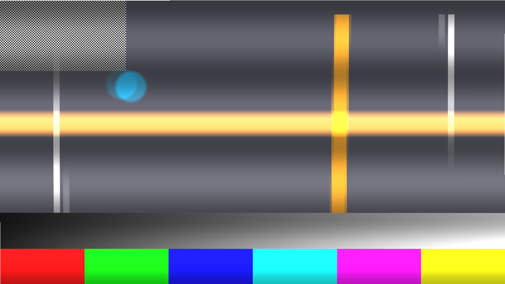

# readout

> **AI-assisted project.** This codebase was created with [Claude](https://claude.com/claude-code)
> (Anthropic), directed and reviewed by a human author. The physics is not asserted
> but measured: an offline harness drives the real plugin class in a headless GL
> context and checks each claim against its closed form — a bar moving at v px/frame
> leans by v, a flash bands `(exposure + length) / readout` of the frame where the
> phase says, 50 and 60 Hz mains bands sit `T_light / readout` apart, a sinusoidal
> shake wobbles the rows at `1/f / readout`, and Global returns the input
> bit-exactly — with a negative control on the last of those so the check can fail.
> It has **never been loaded into Resolume**. It has been loaded by
> [oxbow](https://github.com/stoatworks-labs/oxbow), which is a real FFGL host and is
> not Resolume. See [Status](#status).

A CMOS rolling shutter, as an FFGL effect for [Resolume](https://resolume.com) Arena
and Avenue.



<sub>One frame, rendered by `rotest`, the offline harness — not captured from
Resolume. A 52 ms readout: the amber band is a 5 ms flash that only the rows exposed
while it fired ever saw, the broad horizontal shading is a 50 Hz lamp beating against
the readout, and the vertical bars are bent because the camera moved while the sensor
was still reading.</sub>

## The one idea

A CMOS sensor does not expose a frame. It exposes and reads its **rows**, one after
another. Row *r* of *H* is read `Readout × ( 1 − r / H )` before the frame's
timestamp, and was integrating light for `Exposure` before that.

So every pixel has a sample window, and the picture is sampled there. That is the
whole plugin.

## What falls out

None of these is drawn. Each is that sample window applied to something:

- **Skew.** A vertical bar moving at *v* px/frame leans by `v × Readout`. The top of
  the frame was read earlier, so it shows the bar further back.
- **Jello.** Shake the camera and every row sees it in a different position, so a
  straight edge comes out as a wave — one full cycle every `1/f` of readout.
- **Flash banding.** A strobe shorter than the readout lights only the rows whose
  exposure window overlapped it. The band is `( Exposure + Length ) / Readout` of the
  frame high, its edges ramp over the shorter of the two, and where it sits is the
  flash's phase.
- **Light flicker banding.** A mains-driven lamp is brightest twice per cycle, so at
  50 Hz it pulses at 100 Hz. Beat that against the readout and you get rolling dark
  bands `T_light / Readout` of the frame apart — the reason phone video of a stage
  looks striped.
- **The propeller**, and partial frames, and every other rolling-shutter photograph
  anybody has ever posted — those need no code at all. They are the first item on this
  list, applied to content that happens to be rotating.

**Global** sets the readout to zero: a global shutter, for comparison. With nothing
else switched on it returns the picture untouched, to the byte.

### The honest limit

A real sensor samples a continuous scene. This one has the frames the host gave it, at
the host's frame rate. Between two of them it either **interpolates** (`Blend`) or
**holds** the older one (`Hold`) — so the lean of a moving bar is right, and the
sub-frame detail of anything moving unevenly between two input frames is the
interpolation's invention rather than an observation.

The camera shake is sampled once per row, not integrated across the exposure. Rows are
the axis that makes jello and that part is exact; a real sensor would also blur the
shake, and this does not.

## Controls

| Group | |
| --- | --- |
| **Sensor** | Readout Time (1–60 ms), Exposure (0–40 ms), Direction (top-down, bottom-up, left-right, right-left), Interpolation (Blend or Hold), Global. |
| **Shake** | Amount, Frequency (2–80 Hz), Rotation, plus an audio input: Audio Drive and Audio Band. A speaker near a camera moves the camera, so the audio drives the pose and the jello follows on its own. |
| **Flash** | Fire (a button), Trigger (Off, Beat, Bar, Onset, Interval), Interval, Length (0.1–20 ms), Phase, Level, Colour. |
| **Light** | Mains (Off, 50 Hz, 60 Hz), Depth. |
| **Output** | Mix. |

Beat and Bar follow Resolume's transport; Onset fires on a transient in the routed
audio. Audio Drive defaults to zero, so with nothing routed the camera sits still.

## Status

**v0.1.0, and honestly early — 21 September 2026.**

`tools/verify.sh` passes on this machine (M4 Max, macOS 26.4.1) against a fresh
universal Release build. What it establishes, in numbers:

| check | result |
| --- | --- |
| `--skew` | a bar at 24 px/frame under a one-frame readout leans **24.000 px**, expected **23.967** — Blend and Hold, top-down and bottom-up |
| `--band` | a 8 ms flash at 4 ms exposure over a 40 ms readout bands **215.0 rows** of 720, expected **216.0**, centred **252.5** against **252.0**, peaking +191/255 |
| `--flicker` | 50 Hz: **120.00 rows** period, expected **120.00**. 60 Hz: **100.00**, expected **100.00** |
| `--jello` | a 40 Hz shake over a 60 ms readout: period **300.00 rows** (expected 300.00), swing **28.80 px** (expected 28.80) |
| `--global` | **0/255** deviation from the input, twice; the negative control differs by 164/255, so the check can fail |
| `tools/sweep.py` | all **20** swept controls measurably change the picture |
| shaders | all 3 compile through `glslc`, not merely through Apple's driver |
| the bundle | universal (`x86_64 arm64`), exports `plugMain`, ad-hoc signs, and `oxbow` reports `SW Readout` / `RO01` / `effect` and renders 120 frames through `plugMain` |

Render cost, 60 frames after a warm-up with `glFinish` both sides, at the defaults:
**0.278 ms** at 720p, **0.517 ms** at 1080p, **0.902 ms** at 1440p and **2.274 ms** at
4K — a seventh of a 60 fps frame at 4K.

**What is not established.** It has never been loaded into Resolume, so how the five
groups present, whether 21 controls read sensibly in an inspector, and what the host's
clock actually looks like on the way in are all untested — the clock-unit calibration
is the fleet's, proven elsewhere against Arena, but this copy has only ever seen a
seconds host. Beat and Bar have only seen a synthetic 120 bpm transport. The audio path
has only seen the harness's synthetic spectrum, never Resolume's FFT. Nothing has been
built for Windows or Linux: the CI and release workflows are adapted from siblings and
have never run. There is no OpenFX port and no browser demo — neither is in scope for
0.1.0 — and no factory presets. There is no release, and nothing has been through a
show.

## Build

Needs CMake 3.15+, a C++17 compiler, and the FFGL SDK submodule.

```bash
git clone --recursive https://github.com/stoatworks-labs/readout
cd readout
cmake -B build -DCMAKE_BUILD_TYPE=Release
cmake --build build --parallel
cmake --install build     # into ~/Documents/Resolume Arena/Extra Effects
```

macOS builds are universal (Apple Silicon + Intel) by default; add
`-DCMAKE_OSX_ARCHITECTURES=arm64` for a faster dev build. Windows needs GLEW via vcpkg.

## Building and testing

The offline harness renders the real plugin class headlessly, on a synthetic 60 fps
clock and a synthetic transport:

```bash
./build/rotest --out /tmp/frame.png --size 1920x1080   # the moving test card
./build/rotest --list                                  # every control, kind and default
./build/rotest --skew                                  # each claim, measured
./build/rotest --band
./build/rotest --flicker
./build/rotest --global
./build/rotest --jello
./build/rotest --bench                                 # 720p through 4K
python3 tools/sweep.py                                 # no control is silently dead
tools/verify.sh                                        # all of it, on a fresh universal build
```

Footage goes through the real shaders with `--pipe`, in the fleet's frame format:

```bash
ffmpeg -i in.mov -f rawvideo -pix_fmt rgba - \
  | ./build/rotest --pipe --size 1920x1080 --script cues.txt \
  | ffmpeg -f rawvideo -pix_fmt rgba -s 1920x1080 -i - out.mov
```

See [`CLAUDE.md`](CLAUDE.md) for the full command reference and
[`AGENTS.md`](AGENTS.md) for the model and the traps.

## Licence

MIT — see [LICENSE](LICENSE). Third-party components are listed in
[ATTRIBUTIONS.md](ATTRIBUTIONS.md).
