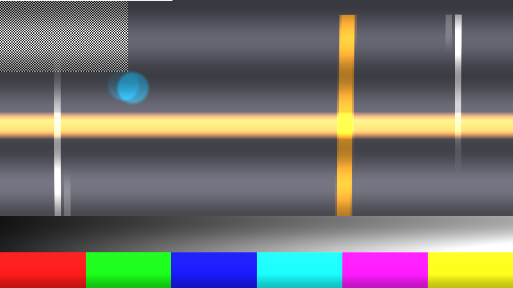
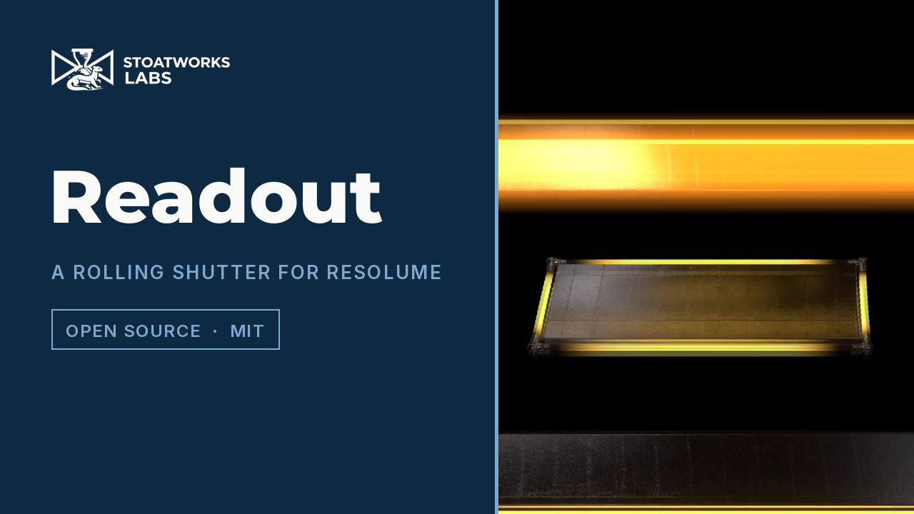

# readout

> **AI-assisted project.** This codebase was created with [Claude](https://claude.com/claude-code)
> (Anthropic), directed and reviewed by a human author. The physics is not asserted
> but measured: an offline harness drives the real plugin class in a headless GL
> context and checks each claim against its closed form — a bar moving at v px/frame
> leans by v, a flash bands `(exposure + length) / readout` of the frame where the
> phase says, 50 and 60 Hz mains bands sit `T_light / readout` apart, a sinusoidal
> shake wobbles the rows at `1/f / readout`, and Global returns the input
> bit-exactly — with a negative control on the last of those so the check can fail.
> It has been registered, loaded and instantiated in **Resolume Arena 7.27.1 on
> Windows**, on a software rasteriser, with its shaders compiling. It has **never run
> on a GPU in Resolume**, and has never been instantiated in Arena on macOS. It is
> also loaded by [oxbow](https://github.com/stoatworks-labs/oxbow), which is a real
> FFGL host and is not Resolume. The [OpenFX build](#openfx--resolve-vegas-nuke-natron)
> renders the same model on the CPU and is held to the GPU's output pixel for pixel. In
> **DaVinci Resolve Studio 21.1** on macOS, as a Fusion tool, the first build **failed** —
> Fusion reports no frame rate on its clips — and the fixed one renders there
> **byte-identical** to the test host at 24 fps, the earlier frames it fetches included.
> It has never been loaded into Vegas, Nuke or Natron. See [Status](#status).

A CMOS rolling shutter, as an FFGL effect for [Resolume](https://resolume.com) Arena
and Avenue, and an OpenFX plugin for DaVinci Resolve, Vegas, Nuke and Natron.



<sub>One frame, rendered by `rotest`, the offline harness — not captured from
Resolume. A 52 ms readout: the amber band is a 5 ms flash that only the rows exposed
while it fired ever saw, the broad horizontal shading is a 50 Hz lamp beating against
the readout, and the vertical bars are bent because the camera moved while the sensor
was still reading.</sub>

[](https://www.youtube.com/watch?v=1dYEzeCZF1Y)

*[Watch it](https://www.youtube.com/watch?v=1dYEzeCZF1Y) — 50 seconds: the readout
ramped the full length of its travel until three tumbling rings come apart, a
wireframe city gone wavy under camera shake, an amber strobe band walking down a dark
room, mains bands rolling over a glow, all of it at once, and Global as the A/B. Every
frame is the real plugin's output: an FFGL plugin has no window, so the footage is
rendered by this repository's own offline harness (`rotest --pipe`, driven by a cue
sheet) rather than filmed off a screen, on Resolume's own bundled demo clips — most of
them played fast, because a rolling shutter's lean is how fast the scene moves
multiplied by the readout, and these loops amble. The audio side is not in it: offline
the only spectrum there is would be a synthetic one, so it is left out rather than
faked.*

<!-- downloads:start -->

## Download

**[v0.1.0](https://github.com/stoatworks-labs/readout/releases/tag/v0.1.0)** — prebuilt for macOS and Windows. Pick your platform:

<details>
<summary><b>macOS</b> — Universal (Apple Silicon + Intel)</summary>

| Build | Download | Size |
| --- | --- | --- |
| Universal (Apple Silicon + Intel) · .dmg disk image | [`readout-0.1.0-macos-universal.dmg`](https://github.com/stoatworks-labs/readout/releases/download/v0.1.0/readout-0.1.0-macos-universal.dmg) | 213 KB |
| Universal (Apple Silicon + Intel) · .zip archive | [`readout-macos-universal.zip`](https://github.com/stoatworks-labs/readout/releases/latest/download/readout-macos-universal.zip) | 176 KB |

</details>

<details>
<summary><b>Windows</b> — x64</summary>

| Build | Download | Size |
| --- | --- | --- |
| x64 · .exe installer | [`readout-0.1.0-windows-x86_64-setup.exe`](https://github.com/stoatworks-labs/readout/releases/download/v0.1.0/readout-0.1.0-windows-x86_64-setup.exe) | 221 KB |
| x64 · .zip archive | [`readout-windows-x86_64.zip`](https://github.com/stoatworks-labs/readout/releases/latest/download/readout-windows-x86_64.zip) | 113 KB |

</details>

All builds, checksums and release notes: [github.com/stoatworks-labs/readout/releases](https://github.com/stoatworks-labs/readout/releases).

macOS builds are signed and notarised and open normally. The Windows builds are unsigned, so SmartScreen warns once.

<!-- downloads:end -->

## Try it in your browser

**<https://readout-demo.stoatworks-labs.com>**

Not the plugin — the GLSL from `source/Shaders.cpp`, copied across unedited and run in
WebGL2 over clips generated in the page, with the frame ring and the control arithmetic
ported alongside it and the parameters this plugin's constructor declares. No install,
and nothing you load leaves your machine.

Start on the geometry card and drag **Readout Time** to the top. Then turn **Amount** up
for the jello, set **Mains** to 50 Hz for the bands, and press **Fire** — or set
**Trigger** to Interval, because one pulse lasts a frame or two, exactly as a real
strobe does.

Two things are **not** on that page, and it says so itself: the whole audio side (the
spectrum arrives through a Resolume parameter and a browser has no equivalent), and
Trigger's Beat and Bar, which read Resolume's transport. It is a port, so it is not
evidence about the plugin either: a browser is not Resolume, GLSL ES 3.00 is not desktop
GL 4.1 core, and nothing on that page measures anything. The numbers worth trusting are
in [Status](#status) and come from the harness in this repository.

## The one idea

A CMOS sensor does not expose a frame. It exposes and reads its **rows**, one after
another. Row *r* of *H* is read `Readout × ( 1 − r / H )` before the frame's
timestamp, and was integrating light for `Exposure` before that.

So every pixel has a sample window, and the picture is sampled there. That is the
whole plugin.

## What falls out

None of these is drawn. Each is that sample window applied to something:

- **Skew.** A vertical bar moving at *v* px/frame leans by `v × Readout`. The top of
  the frame was read earlier, so it shows the bar further back.
- **Jello.** Shake the camera and every row sees it in a different position, so a
  straight edge comes out as a wave — one full cycle every `1/f` of readout.
- **Flash banding.** A strobe shorter than the readout lights only the rows whose
  exposure window overlapped it. The band is `( Exposure + Length ) / Readout` of the
  frame high, its edges ramp over the shorter of the two, and where it sits is the
  flash's phase.
- **Light flicker banding.** A mains-driven lamp is brightest twice per cycle, so at
  50 Hz it pulses at 100 Hz. Beat that against the readout and you get rolling dark
  bands `T_light / Readout` of the frame apart — the reason phone video of a stage
  looks striped.
- **The propeller**, and partial frames, and every other rolling-shutter photograph
  anybody has ever posted — those need no code at all. They are the first item on this
  list, applied to content that happens to be rotating.

**Global** sets the readout to zero: a global shutter, for comparison. With nothing
else switched on it returns the picture untouched, to the byte.

### The honest limit

A real sensor samples a continuous scene. This one has the frames the host gave it, at
the host's frame rate. Between two of them it either **interpolates** (`Blend`) or
**holds** the older one (`Hold`) — so the lean of a moving bar is right, and the
sub-frame detail of anything moving unevenly between two input frames is the
interpolation's invention rather than an observation.

The camera shake is sampled once per row, not integrated across the exposure. Rows are
the axis that makes jello and that part is exact; a real sensor would also blur the
shake, and this does not.

## Controls

| Group | |
| --- | --- |
| **Sensor** | Readout Time (1–60 ms), Exposure (0–40 ms), Direction (top-down, bottom-up, left-right, right-left), Interpolation (Blend or Hold), Global. |
| **Shake** | Amount, Frequency (2–80 Hz), Rotation, plus an audio input: Audio Drive and Audio Band. A speaker near a camera moves the camera, so the audio drives the pose and the jello follows on its own. |
| **Flash** | Fire (a button), Trigger (Off, Beat, Bar, Onset, Interval), Interval, Length (0.1–20 ms), Phase, Level, Colour. |
| **Light** | Mains (Off, 50 Hz, 60 Hz), Depth. |
| **Output** | Mix. |

Beat and Bar follow Resolume's transport; Onset fires on a transient in the routed
audio. Audio Drive defaults to zero, so with nothing routed the camera sits still.

## OpenFX — Resolve, Vegas, Nuke, Natron

The same effect also builds as an OpenFX plugin, **Readout** under **Stoatworks**
(`com.stoatworks.readout`), for DaVinci Resolve, Vegas Pro, Nuke and Natron. It is
not a port of the model: the controls, the shake, the flash pulse, the mains light and
every number the readout pass is handed come from the same C++ the FFGL build runs
(`source/Controls.cpp`, `source/Sensor.cpp`). What is written twice is the readout
shader's per-pixel arithmetic, which runs on the CPU here, and `rotest --mirror` holds
the two copies to each other frame by frame.

Releases carry it from **v0.2.0**, as `readout-ofx-macos-universal.zip`,
`readout-ofx-windows-x86_64.zip` and `readout-ofx-linux-x86_64.zip`. Unzip the one for
your platform and copy `Readout.ofx.bundle` into the standard OpenFX folder, then
restart the host:

```
macOS    /Library/OFX/Plugins/
Windows  C:\Program Files\Common Files\OFX\Plugins\
Linux    /usr/OFX/Plugins/
```

On macOS that folder belongs to root, so the copy needs an administrator. The Linux
build targets glibc 2.28 — Rocky 8, the distro Resolve supports — and newer.

### What is different from the Resolume build

Same parameter names, ranges, defaults and groups wherever the idea carries over, so
one set of docs covers both. These are the exceptions, and each has a reason:

- **The ring is the timeline.** Resolume hands the plugin one frame at a time and it
  remembers the last sixteen. An OpenFX host renders frames in any order, alone and
  on several threads, so the plugin instead *fetches* the source at `t − 1`, `t − 2`
  … through temporal clip access — only as far back as the first row's window reaches
  (back to `t − 2` at the defaults at 60 fps, `t − 7` at the longest window), and never
  more than sixteen. That is exact where the Resolume build is merely faithful: a
  scrub or a dropped frame cannot put pictures in the window that were never
  adjacent, and any frame renders on its own the same way every time. At the very
  start of a clip there is no history yet, and an age the clip has not got reads the
  oldest frame there is — which is what the Resolume build does while its ring fills.
- **No audio.** OpenFX gives a plugin no audio input, so **Audio Drive**, **Audio
  Band** and the **Onset** trigger do not exist here rather than exist and do nothing.
- **No Beat or Bar.** They read Resolume's transport; OpenFX has none.
- **No Fire button.** A press is an event at wall-clock time, and a frame that may be
  rendered before the frame preceding it cannot depend on one. **Trigger** offers
  **Off**, **Once** and **Interval** instead, anchored to the timeline by **Fire At**
  (seconds — frame number ÷ frame rate — and keyframeable): Once fires on the first
  frame at or after Fire At, which is the press placed on the edit; Interval fires at
  Fire At and every Interval after it. Each pulse is exactly the one the Resolume
  build fires on that frame, centred on that frame's Phase point. Resolume's Interval
  counts from whichever frame fired last, so its period is Interval rounded up to whole
  frames; here the schedule is a fixed grid and averages Interval exactly.
- **The frame period is the clip's.** The Resolume build measures the host's frame
  period from its clock, because nothing tells it; an OpenFX host does.
- **Float stays float.** In a float project a flash at Level 2 is brighter than white
  and is left that way; 8- and 16-bit output is clamped, as Resolume's is.
- **Resolve's Fusion page reports the frame rate on the effect but not on its clips; the
  plugin reads the effect's, and assumes 24 fps only where a host reports none.** So
  Readout Time, Exposure, the shake, the mains flicker and Fire At, which are all in
  seconds, are right in Fusion at the composition's own rate. A clip frame range of
  0 to 0 is treated as unknown: the plugin fetches the earlier frames anyway, so the
  readout still reaches back.

## Status

**v0.2.0, and honestly early — 4 October 2026.** v0.2.0 adds the OpenFX build; the
Resolume build is the one v0.1.0 shipped on 21 September, refactored to share its
sensor model and byte-identical to it in the nine configurations compared.

### Measured offline, on macOS

`tools/verify.sh` passes on this machine (M4 Max, macOS 26.4.1) against a fresh
universal Release build. What it establishes, in numbers:

| check | result |
| --- | --- |
| `--skew` | a bar at 24 px/frame under a one-frame readout leans **24.000 px** in all three cases — Blend and Hold, top-down and bottom-up. Blend's closed form is **23.967** (the last row is read 1/H of a frame early) and Hold's is **24.000** (it snaps to whole source frames); each is inside the harness's **0.1 px** tolerance, so all three pass |
| `--band` | a 8 ms flash at 4 ms exposure over a 40 ms readout bands **215.0 rows** of 720, expected **216.0**, centred **252.5** against **252.0**, peaking +191/255 |
| `--flicker` | 50 Hz: **120.00 rows** period, expected **120.00**. 60 Hz: **100.00**, expected **100.00** |
| `--jello` | a 40 Hz shake over a 60 ms readout: period **300.00 rows** (expected 300.00), swing **28.80 px** (expected 28.80) |
| `--global` | **0/255** deviation from the input, twice; the negative control differs by 164/255, so the check can fail |
| `tools/sweep.py` | all **20** swept controls measurably change the picture |
| shaders | all 3 compile through `glslc`, not merely through Apple's driver |
| the bundle | a local build is universal (`x86_64 arm64`), exports `plugMain` and ad-hoc signs; `oxbow` reports `SW Readout` / `RO01` / `effect` and renders 120 frames through `plugMain` |

Render cost, 60 frames after a warm-up with `glFinish` both sides, at the defaults:
**0.278 ms** at 720p, **0.517 ms** at 1080p, **0.902 ms** at 1440p and **2.274 ms** at
4K — a seventh of a 60 fps frame at 4K. Those are macOS figures and only macOS
figures.

### In Resolume Arena, on Windows — 21 September 2026

The DLL taken to Arena was **cross-compiled in the Parallels guest on this Mac** (ARM64
Windows 11, MSVC 2022 Build Tools, `cmake -A x64`, vcpkg triplet
`x64-windows-static-md`), because there is no x64 Windows machine in the local build
loop. It comes out at **374,272 bytes**, and `dumpbin /EXPORTS` shows **`plugMain`**.
The *released* DLL is a different build: CI builds x64 Windows on every push and the
release workflow builds it again on a GitHub runner. That build has never been put in
front of Arena.

That DLL was taken to win-lab — an x64 Windows 11 Pro VM with **no GPU**: the adapter
is the Microsoft Basic Display Adapter, so OpenGL comes from **Mesa llvmpipe** dropped
in beside Arena. The plugin reported the context itself:
`GL vendor=Mesa renderer=llvmpipe (LLVM 22.1.8, 256 bits) version=4.5 (Core Profile) Mesa 26.2.0`.

| check | result, in **Resolume Arena 7.27.1** (build 15990) unless noted |
| --- | --- |
| Arena registers it | `/api/v1/effects` lists **`SW Readout`** among 112 video effects, under its FFGL id **`RO01`** as `idstring`, with the description the plugin declares |
| Arena loads the DLL | `%LOCALAPPDATA%\readout\` holds `plugin loaded build=<stamp>`, the stamp of the DLL built minutes earlier |
| Arena instantiates it, and the shaders compile | applied from Arena's own effects browser: the diag log shows the Mesa 4.5 Core Profile line and then `initialised`, and Arena drew its inspector for it, groups and all |
| `oxbow selftest`, x64 | **120 frames, gl error 0x0, PASS**, with **921,600 of 921,600** pixels lit (100%) |
| the diag log | clean of WARN, ERROR and FAIL |

**The clock-unit detection has now met a real host.** This repo is where the
float-overflow trap in Resolume's clock was found, and the detector that votes on the
host's unit had until now only ever seen a seconds host. Under `oxbow` this plugin's
own diag log still settles on **seconds** (`scale=1.000000` by frame 60). Under Arena
the fleet's plugins saw **milliseconds** — a raw host time of about **574,073** — and
the detection decided milliseconds there. So the trap is real in Arena and the
detection handles it. What was not read back is this plugin's own in-Arena vote: the
milliseconds line came from a sibling's log, not from `readout`'s.

**What is not established.** It has **never run on a GPU in Resolume** — the Windows
run was llvmpipe, a software rasteriser — and it has **never been instantiated in
Arena on macOS**. Nothing was timed on Windows: there is no frame timing from win-lab
at all, so whether the render cost above survives a real host is an open question. The
effect was applied to the **composition**, not to a clip — `/api/v1/…/clips/1` still
showed only `Transform` afterwards, so the proof of instantiation is the diag log, not
the clip's effect list. No long session, no composition save or reload and no preset
recall in the host were exercised. No real audio reached the plugin in Arena: the audio
path has still only seen the harness's synthetic spectrum, never Resolume's FFT, and
the 64-bin mapping is still assumed rather than measured. Beat and Bar have only seen a
synthetic 120 bpm transport. Resolume has no Linux build, so neither does the FFGL
plugin. There is no user guide and no factory presets. Nothing has been through a
show. The [browser demo](#try-it-in-your-browser) is a WebGL2 port and proves nothing
about the plugin; it exists to be looked at, not to be cited.

### The OpenFX build — from v0.2.0

Built and checked on 3 October 2026, on the M4 Max above, and in CI; taken to DaVinci
Resolve on 4 October; released in v0.2.0 as the three `readout-ofx-` zips.

| check | result |
| --- | --- |
| against the Resolume build, frame by frame | the same 30-frame 640×360 moving card at 60 fps through the FFGL plugin on the GPU (`rotest --pipe`) and through the OpenFX plugin in a CPU test host fed the frames as a sequence. Frames 0, 1, 2, 3, 8, 15, 16, 17 and 29 — the first four while the history is still filling — in seven configurations: the defaults, shake and rotation, 60 Hz mains with a long exposure read left to right, Hold read right to left at 60 ms, a flash fired once, a 0.1 s Interval, and Global with Mix 0.6. **Worst 1/255 in every one**; at most 1.4% of pixels differ at all, and 60 Hz and Interval are identical to the byte. Over all 30 frames the Interval flashes land on frames 0, 6, 12, 18 and 24 in both. Rendering the OpenFX side at a different Readout Time differs by 171/255, so the comparison can fail |
| the two copies of the readout shader | `rotest --mirror`, nine cases over twelve 1280×720 frames each: **worst 1/255** against the GPU, one pixel in twelve frames of shake decided inside/outside the shaken frame's edge the other way, and the one-frame-readout bar leans **24.000 px** under Blend and Hold, exactly as on the GPU. On CI's software renderer at 320×180 the shake case reaches 3/255, which is that renderer's texture filter; every other case stays at 1 |
| frame N on its own | frames 2, 12 and 20 with shake, the longest window, mains and Interval flashes: rendered alone, rendered after 0..N−1 in one instance, and rendered first and then backwards all give the **same bytes**; so does a run where the host refuses every fetch outside what `getFramesNeeded` declared, with no fetch refused |
| the window | at frame 20 the plugin asks for 18–20 at the defaults and 13–20 at the longest window at 60 fps; at 240 fps, 14–20 and 5–20 — the 16-frame bound |
| float | the same comparison in a 32-bit float project: worst 1/255 |
| stricter than Resolve's Fusion page | a test host withholding more than Fusion does — no frame rate anywhere, not even the effect's, and every frame range 0 to 0. The build before the fix fails there exactly as it did in Resolve (`kOfxStatErrMissingHostFeature`); this one renders, **byte-identical** to the normal host at 24 fps in five configurations and eight frames each, asks for frames 12–15 at frame 15 with the longest window, and on settled mid-clip frames of a 90-frame run agrees with the Resolume build at 24 fps to **1/255** — which reads frames `t − k` from its ring, so this does too. A clip numbered from 1001, which the test host still reports as 0 to 0, renders the same as on the normal host |
| **DaVinci Resolve Studio 21.1**, Fusion page | the fixed build on macOS on 4 October 2026, as a Fusion tool (MediaIn → Readout → MediaOut, a render job to PNG): frames 0–5 of a 1920×1080 moving card with Amount 0.8 and Readout Time 0.8 are **byte-identical** to the test host's render of the same frames at 24 fps — including the earlier frames the plugin fetches, so Resolve hands them over as the test host does. The effect changes up to 705,684 of the 2,073,600 pixels in those frames |
| render cost | 1920×1080 on the test host's 8 threads: **3.6 ms** a frame at the defaults, 5.9 ms at the longest window, 8.7 ms with shake on, 12.9 ms with everything on |
| the bundle | universal (`x86_64 arm64`), exports `OfxGetPlugin`, names its own binary in its plist and ad-hoc signs; `tools/verify.sh` checks all of it and that a still picture comes back untouched |
| Windows and Linux | CI builds the Windows `.ofx`; the Linux one is built in AlmaLinux 8 against glibc 2.28 and `dlopen`ed on a stock Rocky 8, the distro Resolve supports, where it reports `com.stoatworks.readout`. A load, not a render |

**What is not established.** It has been in one real host: **DaVinci Resolve Studio
21.1** on macOS, as a Fusion tool. The first build **failed** there — Fusion reports no
frame rate on its clips, and the plugin let the missing property fail the render; the
fixed build renders there, six frames at one setting (see [`AGENTS.md`](AGENTS.md)).
Nothing has rendered it on Resolve's Edit or Color page, and it has never been loaded
into Vegas, Nuke or Natron; everything else above is the fleet's own probe hosts and
this repository's harness. Those hosts hand over 8-bit and float RGBA, premultiplied, at
full resolution — so the 16-bit path, an unpremultiplied clip, an RGB clip and a proxy
render scale have never been exercised. Nobody has seen how a real host answers for the
frames before a clip's head, or how Resolve draws a keyframeable seconds parameter like
Fire At. The Windows and Linux builds have never rendered in a host: the Windows one has
never been loaded by anything, and the Linux one only by `dlopen`.

## Build

Needs CMake 3.15+, a C++17 compiler, and the FFGL SDK submodule.

```bash
git clone --recursive https://github.com/stoatworks-labs/readout
cd readout
cmake -B build -DCMAKE_BUILD_TYPE=Release
cmake --build build --parallel
cmake --install build     # into ~/Documents/Resolume Arena/Extra Effects
```

macOS builds are universal (Apple Silicon + Intel) by default; add
`-DCMAKE_OSX_ARCHITECTURES=arm64` for a faster dev build. Windows needs GLEW via vcpkg.
The OpenFX plugin builds alongside the FFGL one into `build/Readout.ofx.bundle`;
`-DBUILD_OFX=OFF` skips it, and `-DREADOUT_BUILD_FFGL=OFF` builds it alone with
nothing but a compiler — no FFGL SDK, no GLEW — which is how the Linux build is made.
The x64 Windows DLL that was loaded into Arena was cross-compiled in the Parallels
guest on this Mac — `cmake -A x64`, MSVC 2022 Build Tools, vcpkg triplet
`x64-windows-static-md`.

## Building and testing

The offline harness renders the real plugin class headlessly, on a synthetic 60 fps
clock and a synthetic transport:

```bash
./build/rotest --out /tmp/frame.png --size 1920x1080   # the moving test card
./build/rotest --list                                  # every control, kind and default
./build/rotest --skew                                  # each claim, measured
./build/rotest --band
./build/rotest --flicker
./build/rotest --global
./build/rotest --jello
./build/rotest --mirror                                # the OpenFX CPU readout matches the GPU
./build/rotest --bench                                 # 720p through 4K
python3 tools/sweep.py                                 # no control is silently dead
tools/verify.sh                                        # all of it, on a fresh universal build
```

Footage goes through the real shaders with `--pipe`, in the fleet's frame format:

```bash
ffmpeg -i in.mov -f rawvideo -pix_fmt rgba - \
  | ./build/rotest --pipe --size 1920x1080 --script cues.txt \
  | ffmpeg -f rawvideo -pix_fmt rgba -s 1920x1080 -i - out.mov
```

See [`CLAUDE.md`](CLAUDE.md) for the full command reference and
[`AGENTS.md`](AGENTS.md) for the model and the traps.

## Licence

MIT — see [LICENSE](LICENSE). Third-party components are listed in
[ATTRIBUTIONS.md](ATTRIBUTIONS.md).
